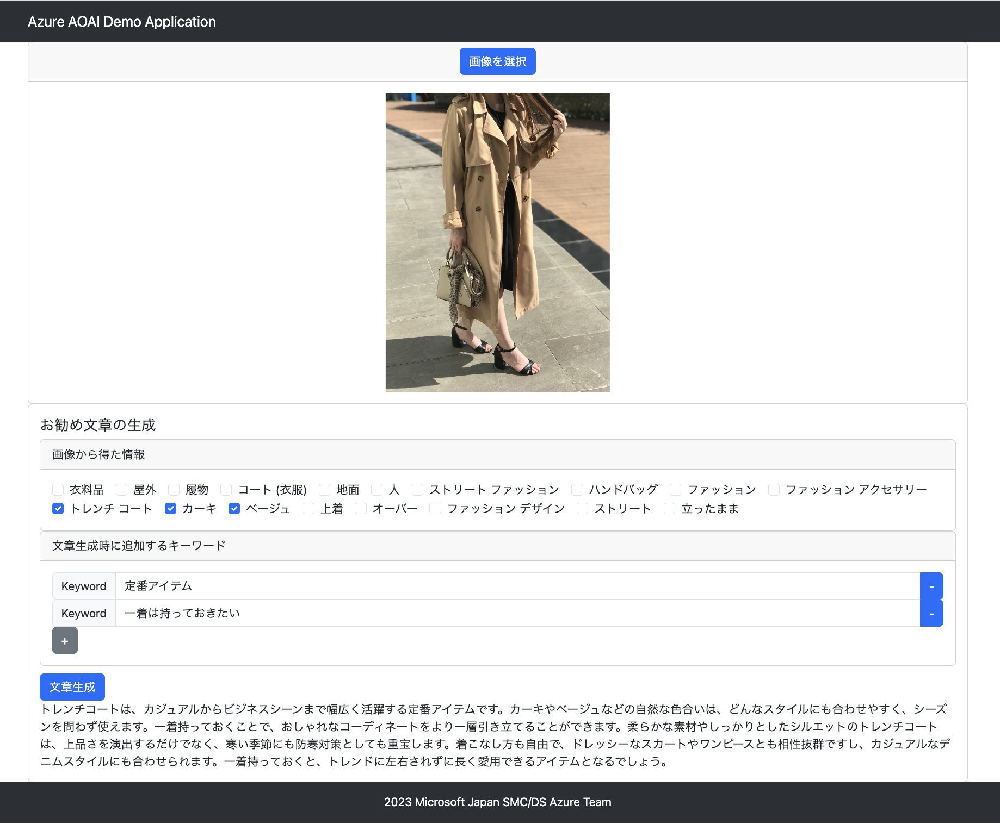

# Azure OpenAI Services　＆ Azure Vision AI Demo Application

Azure OpenAI Services と Azure Vision AI を組み合わせたデモアプリケーションです。



## Features

* 商品画像をUploadすると、Azure Vision AI(Computer Vision) が商品画像に写っている対象物の情報を取得し、それが選択できるようになります。
* 商品画像から取得した情報と、手動で入力したキーワードを元に商品画像をお勧めする文章を Azure OpenAI Services が生成します。
* 商品画像、生成したお勧めの文章は保存しません。
* 認証機能はありません。

## 環境準備

ローカルで実行する場合も Azure OpenAI Services と Azure Vision AI のリソースを作成する必要があります。

### Azure OpenAI Services　の準備

1. Azure OpenAI Services を利用するためには申請が必要です。（2023/10時点） [https://aka.ms/oai/access](https://aka.ms/oai/access)にアクセスし、申請を行なって下さい。
2. 申請が承認された Azure サブスクリプションにて、Azure OpenAI Services のリソースを作成して下さい。
3. Azure OpenAI Studio を開き、gpt-35-turboをデプロイして下さい。
4. 次の3つの情報を控えておきます。
   1. Azure OpenAI Services のエンドポイント
   2. Azure OpenAI Services のAPIキー
   3. Azure OpenAI Studio でデプロイしたモデルの名前

### Azure Vision AI(Computer Vision) の準備

1. Azure Portal にログインし、Azure Computer Vision のリソースを作成して下さい。
2. 次の2つの情報を控えておきます。
   1. Azure Computer Vision のエンドポイント
   2. Azure Computer Vision のAPIキー

## ローカル環境の構築と実行

以下のツールをインストールして下さい:

* [Node.js 14+](https://nodejs.org/en/download/)
* [Java 17](https://learn.microsoft.com/ja-jp/java/openjdk/download#openjdk-17)
* [Visual Studio Code](https://code.visualstudio.com/)
  * Option: VSCode での実行は必須ではありませんが、ローカル実行用の設定ファイルが本リポジトリに含まれています。

### 　ローカルで Backend API の実行

1. aoai-demo-backend/src/resources に application-dev.properties ファイルを作成し、次の内容を貼り付けます。

    ```application.properties
    OPENAI_ENDPOINT=
    OPENAI_KEY=
    OPENAI_MODEL_NAME=
    COMPUTER_VISION_ENDPOINT=
    COMPUTER_VISION_KEY=
    OPENAI_SYSTEM_PROMPT=
    PORT=
    ```

    OPENAI_ENDPOINT, OPENAI_KEY, OPENAI_MODEL_NAME, COMPUTER_VISION_ENDPOINT, COMPUTER_VISION_KEY は、Azure Portal で取得した値を入力します。PORTには特に理由がない場合は8080を入力します。OPENAI_SYSTEM_PROMPTには次のように商品をお勧めするための文章をセットします。

    ```text
    あなたはマーケティングの担当者です。入力された情報をもとに、ユーザーに訴求できるような広告に掲載するメッセージを生成してください。
    ```

2. VSCode を開き、aoai-demo-backend フォルダを開きます。

3. Terminal を開き、以下のコマンドを実行して下さい:

    ```bash
    ./mvnw clean install
    ```

4. デバッグ実行またはデバッグなしで実行して下さい。

### ローカルで Frontend の実行

1. yarn のインストールを行います。
2. Terminalを開き、次のコマンドを実行します。

    ```bash
    npm install -g yarn
    ```

3. Azure Static WebAppsのローカル開発用のツールである SWA CLI をインストールします。Terminalを開き、次のコマンドを実行します。

    ```bash
    npm install -g @azure/static-web-apps-cli@1.1.2
    ```

    * 【重要】2023/10時点での最新版である1.1.4はインストールしないでください。最新版の 1.1.4 は api サーバーの ルート [http://localhost:8080](http://localhost:8080) が 404 を返すとエラーになってしまう不具合があるためです。

4. VSCode を開き、aoai-demo-frontend フォルダを開きます。
5. Terminal を開き、以下のコマンドを実行して下さい:

    ```bash
    yarn install
    ```

6. VSCode の左メニューバーの実行とデバッグアイコンをクリックします。
7. Microsoft Edge ブラウザで実行する場合はドロップダウンメニューからSWA: Run Edgeを選択します。Google Chrome ブラウザで実行する場合はドロップダウンメニューからSWA: Run Chrome を選択します。

## Azure へのデプロイ

### Azure リソースの作成

* Azure App Serivce と Azure Static Web Apps のリソースを作成します。
  
### Azure App Service へのデプロイ

* aoai-demo-backend フォルダを VSCode で開き、 Azure App Service にデプロイします。
* 環境変数の設定
  * 上記手順「ローカルで Backend API の実行」でapplication-dev.propertiesにセットアップした内容を Azure App Service の環境変数に設定します。

### Azure Static WebApps へのデプロイ

Azure Static WebApps へのデプロイは SWA CLI からもしくは GitHub または Azure DevOps のCI/CD 機能を用いてデプロイを行なって下さい。
